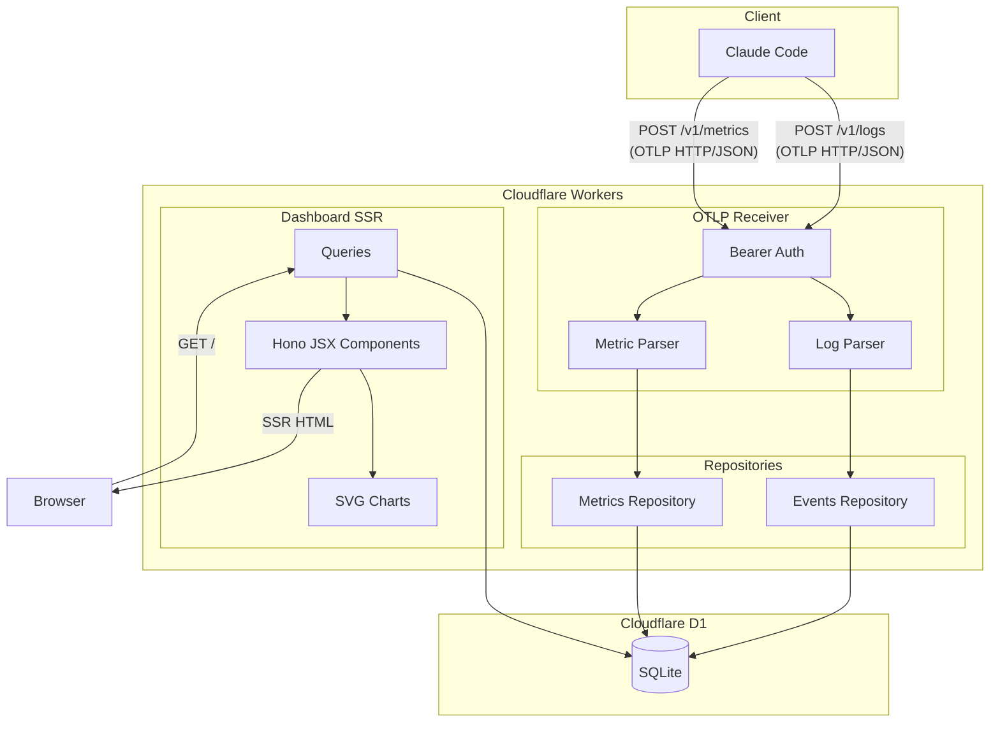
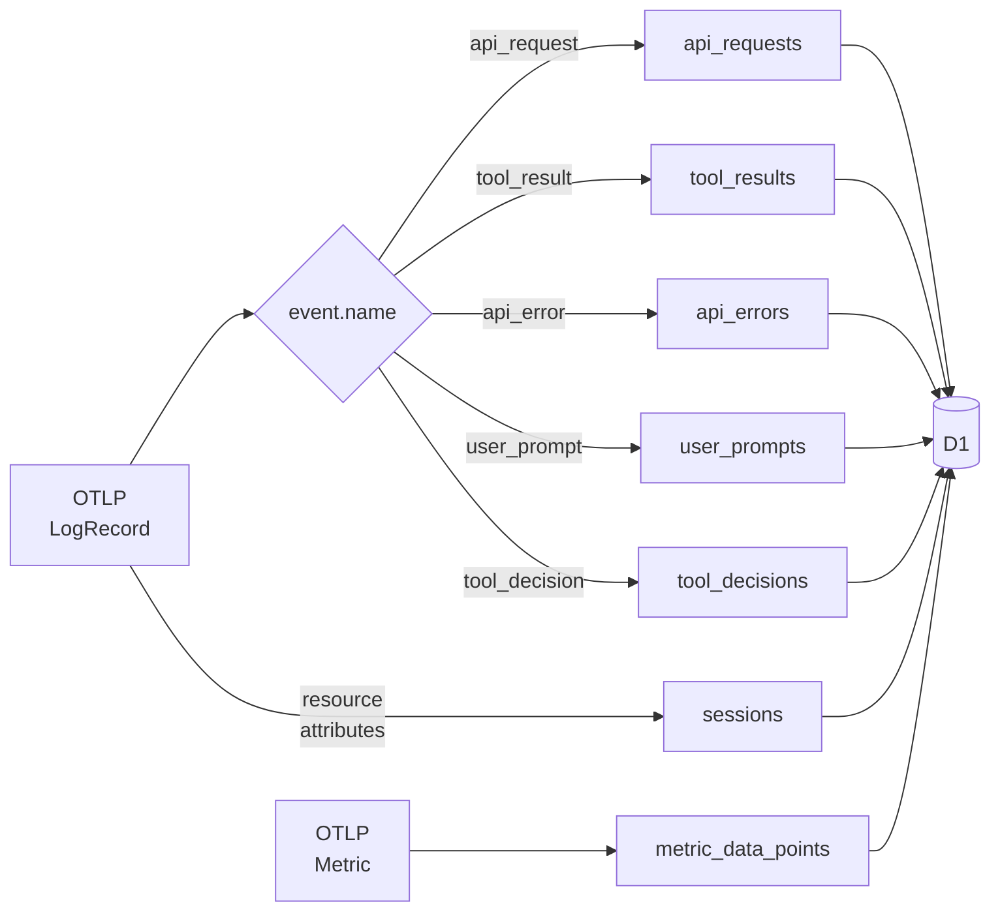
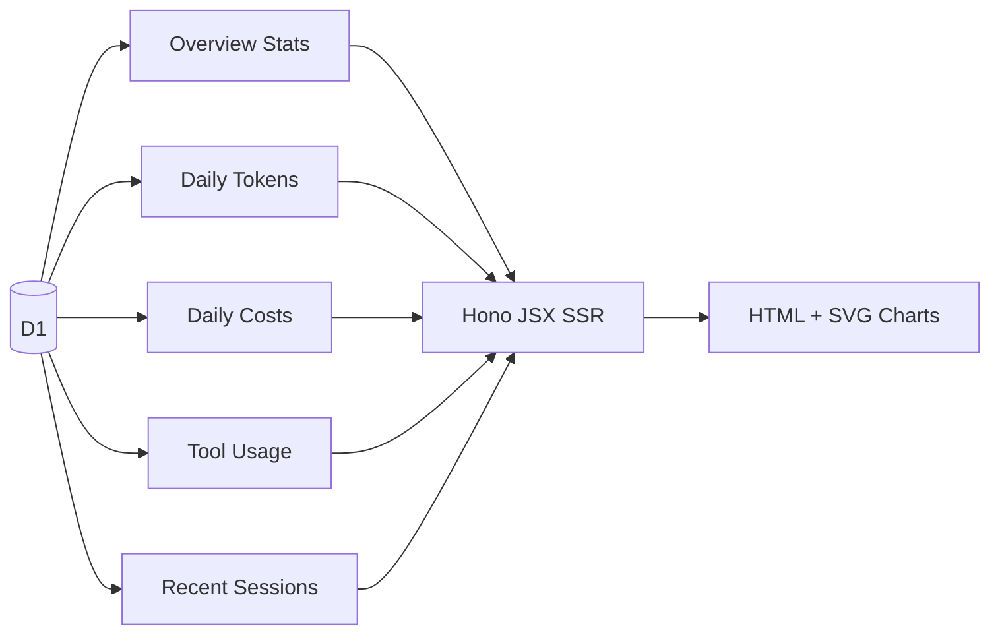
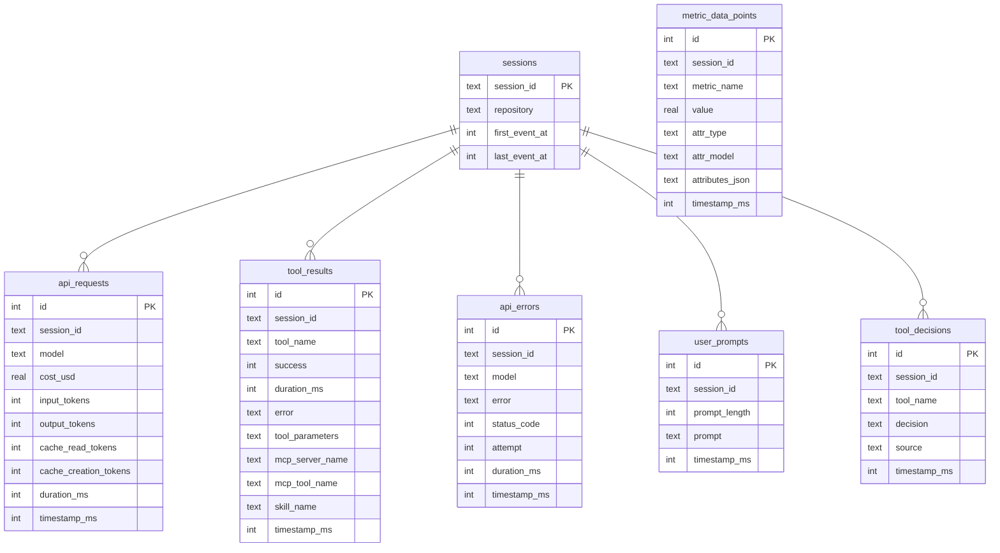

# CC Dashboard

Claude Code の OpenTelemetry テレメトリデータを受信・可視化する個人向け軽量ダッシュボード。

## アーキテクチャ



### データフロー

**テレメトリ取り込み** (Claude Code → D1)



**ダッシュボード表示** (D1 → Browser)



## 技術スタック

| 領域 | 技術 |
|------|------|
| ランタイム | Cloudflare Workers |
| DB | Cloudflare D1 (SQLite) |
| フレームワーク | Hono (JSX SSR) |
| チャート | SVG (サーバーサイド生成、依存なし) |
| テスト | Vitest + @cloudflare/vitest-pool-workers |
| Lint / Format | Biome |

## DB スキーマ



## セットアップ

### ローカル開発

```bash
pnpm install
pnpm db:migrate:local
pnpm dev
```

`.dev.vars` に認証トークンを設定:

```
AUTH_TOKEN=dummy
```

### Claude Code の OTLP 送信設定

`~/.claude/settings.json` に追加:

```json
{
  "env": {
    "CLAUDE_CODE_ENABLE_TELEMETRY": "1",
    "OTEL_METRICS_EXPORTER": "otlp",
    "OTEL_LOGS_EXPORTER": "otlp",
    "OTEL_EXPORTER_OTLP_PROTOCOL": "http/json",
    "OTEL_EXPORTER_OTLP_ENDPOINT": "http://localhost:8787",
    "OTEL_EXPORTER_OTLP_HEADERS": "Authorization=Bearer dummy",
    "OTEL_LOG_TOOL_DETAILS": "1"
  }
}
```

`OTEL_LOG_TOOL_DETAILS=1` を設定すると、MCP ツール名（`mcp_server_name`, `mcp_tool_name`）やスキル名（`skill_name`）がダッシュボードに表示される。未設定の場合、MCP ツールは `mcp_tool` としてまとめて表示される。

### リポジトリ別フィルタの設定

ダッシュボードはリポジトリ別にコストやセッションをフィルタできる。Claude Code は `repository` 属性を自動送信しないため、プロジェクトごとに `OTEL_RESOURCE_ATTRIBUTES` で明示的に設定する必要がある。

各プロジェクトの `.claude/settings.json` に追加:

```json
{
  "env": {
    "OTEL_RESOURCE_ATTRIBUTES": "repository=<リポジトリ名>"
  }
}
```

- `repository` の値はダッシュボードのフィルタドロップダウンに表示される
- 設定しない場合、セッションの `repository` は空になりフィルタで「(未設定)」として扱われる
- グローバル設定（`~/.claude/settings.json`）ではなくプロジェクトごとの設定（`.claude/settings.json`）を使う

### デプロイ

```bash
pnpm wrangler d1 create <db-name>    # D1 作成 → wrangler.toml に ID 設定
pnpm db:migrate:remote                # マイグレーション適用
echo "<token>" | pnpm wrangler secret put AUTH_TOKEN
pnpm run deploy
```